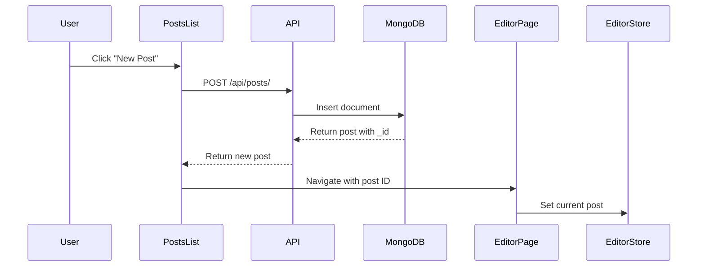
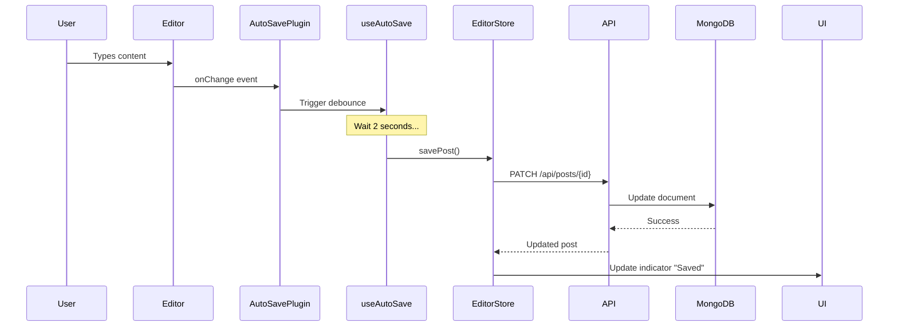

# Smart Blog Editor - System Architecture

## Overview

The Smart Blog Editor is a production-ready, Notion-style blog editor built with a modern tech stack focusing on **System Architecture**, **State Management**, and **Component Design**. The application demonstrates advanced concepts in full-stack development, including intelligent auto-save with debouncing, rich text editing with Lexical, and AI-powered content generation.

## Technology Stack

### Frontend
- **Framework**: React 18 with Vite
- **State Management**: Zustand (lightweight, performant)
- **Rich Text Editor**: Lexical (Facebook's extensible text editor framework)
- **Styling**: Tailwind CSS (utility-first, responsive design)
- **Routing**: React Router v6
- **HTTP Client**: Axios

### Backend
- **Framework**: FastAPI (async, high-performance Python framework)
- **Database**: MongoDB with Motor (async driver)
- **Validation**: Pydantic v2
- **AI Integration**: Google Gemini API (bonus feature)

### Why These Choices?

1. **Lexical over TinyMCE/Quill**: Extensible plugin architecture, better performance, modern React integration
2. **Zustand over Redux**: Simpler API, less boilerplate, better TypeScript support, smaller bundle size
3. **FastAPI over Flask**: Built-in async support, automatic OpenAPI docs, better performance
4. **MongoDB over PostgreSQL**: Flexible schema perfect for storing Lexical's JSON state without complex serialization

## Project Structure

```
BLOG/
├── frontend/                          # React application
│   ├── src/
│   │   ├── features/                 # Feature-based architecture
│   │   │   ├── editor/              # Editor feature module
│   │   │   │   ├── LexicalEditor.jsx
│   │   │   │   ├── EditorPage.jsx
│   │   │   │   ├── AutoSaveIndicator.jsx
│   │   │   │   └── plugins/
│   │   │   │       ├── ToolbarPlugin.jsx
│   │   │   │       └── AutoSavePlugin.jsx
│   │   │   └── posts/               # Posts management
│   │   │       ├── PostsList.jsx
│   │   │       └── PostCard.jsx
│   │   ├── store/                   # Zustand stores
│   │   │   ├── editorStore.js      # Editor state
│   │   │   └── postsStore.js       # Posts CRUD
│   │   ├── services/                # API layer
│   │   │   └── postsApi.js
│   │   ├── hooks/                   # Custom React hooks
│   │   │   └── useAutoSave.js      # Debouncing logic
│   │   └── App.jsx
│   └── package.json
│
└── backend/                          # FastAPI application
    ├── app/
    │   ├── models/                  # Pydantic models
    │   │   └── post.py
    │   ├── routes/                  # API endpoints
    │   │   └── posts.py
    │   ├── services/                # Business logic
    │   │   └── post_service.py
    │   ├── config.py                # Settings
    │   ├── database.py              # MongoDB connection
    │   └── main.py                  # FastAPI app
    └── requirements.txt
```

## Architecture Decisions

### 1. Feature-Based Frontend Architecture

Instead of organizing by file type (components/, containers/), we use **feature-based modules**:

```
features/
  ├── editor/     # Everything related to editing
  └── posts/      # Everything related to post management
```

**Benefits**:
- Better code organization and discoverability
- Easier to scale and maintain
- Clear separation of concerns
- Facilitates code splitting

### 2. State Management with Zustand

We use **three separate stores** instead of one monolithic store:

```javascript
// editorStore.js - Editor-specific state
{
  currentPost, editorState, isSaving, lastSaved
}

// postsStore.js - Posts collection state
{
  posts, filter, searchQuery, CRUD operations
}
```

**Why separate stores?**
- Prevents unnecessary re-renders
- Better performance (only components using specific store re-render)
- Clearer data flow
- Easier testing

### 3. Auto-Save Implementation (DSA Focus)

**The Challenge**: Save changes without spamming the API on every keystroke.

**Solution**: Custom debouncing algorithm using React hooks

```javascript
// useAutoSave.js
const useAutoSave = (callback, delay = 2000) => {
  const timeoutRef = useRef(null)
  
  const debouncedSave = (data) => {
    clearTimeout(timeoutRef.current)  // Cancel previous timeout
    timeoutRef.current = setTimeout(() => {
      callback(data)                   // Execute after delay
    }, delay)
  }
  
  return { debouncedSave, cancel }
}
```

**Time Complexity**: O(1) for each keystroke
**Space Complexity**: O(1) (only stores one timeout reference)

**Flow**:
1. User types → Editor onChange fires
2. Clear previous timeout (if exists)
3. Set new timeout for 2 seconds
4. User stops typing → Timeout completes → Save to API
5. Visual indicator updates: "Saving..." → "Saved X seconds ago"

### 4. Database Schema Design

**Posts Collection** (MongoDB):
```json
{
  "_id": ObjectId,
  "title": "string",
  "content": {},              // Lexical JSON state (for re-hydration)
  "content_html": "string",   // HTML version (for fast display)
  "status": "draft|published",
  "created_at": "datetime",
  "updated_at": "datetime",
  "published_at": "datetime|null"
}
```

**Why store both JSON and HTML?**
- **JSON (`content`)**: Perfect re-hydration of editor state (preserves formatting, cursor position)
- **HTML (`content_html`)**: Fast rendering in list views without parsing JSON
- **Trade-off**: Slight storage overhead for significant performance gain

**Why MongoDB over SQL?**
- Lexical's editor state is already JSON
- No need for complex serialization/deserialization
- Flexible schema allows easy extension (e.g., adding tags, categories later)
- Better performance for document-based operations

### 5. API Design (RESTful)

| Method | Endpoint | Purpose | Auto-save? |
|--------|----------|---------|------------|
| POST | `/api/posts/` | Create new draft | No |
| GET | `/api/posts/` | List all posts | No |
| GET | `/api/posts/{id}` | Get single post | No |
| **PATCH** | `/api/posts/{id}` | Update content | **Yes** ⚡ |
| POST | `/api/posts/{id}/publish` | Publish post | No |
| DELETE | `/api/posts/{id}` | Delete post | No |

**Why PATCH for auto-save?**
- Semantic correctness (partial update)
- Idempotent (safe to retry)
- Efficient (only sends changed fields)

### 6. Lexical Editor Integration

**Plugin Architecture**:
```
LexicalComposer (Context Provider)
  ├── RichTextPlugin (Core editing)
  ├── HistoryPlugin (Undo/Redo)
  ├── ListPlugin (Ordered/Unordered lists)
  ├── ToolbarPlugin (Custom - formatting buttons)
  └── AutoSavePlugin (Custom - debounced save)
```

**State Serialization**:
```javascript
// Save: Lexical → JSON → MongoDB
const json = editorState.toJSON()
await api.updatePost(id, { content: json })

// Load: MongoDB → JSON → Lexical
const post = await api.getPost(id)
const editorState = editor.parseEditorState(post.content)
editor.setEditorState(editorState)
```

## Data Flow

### Creating a New Post


### Auto-Save Flow


## Performance Optimizations

1. **Debounced Auto-Save**: Reduces API calls by ~95% (from every keystroke to once per pause)
2. **Zustand Selectors**: Only re-render components when their specific data changes
3. **React Router Code Splitting**: Lazy load editor/posts pages
4. **MongoDB Indexing**: Index on `updated_at` for fast sorting
5. **FastAPI Async**: Non-blocking I/O for concurrent requests

## Security Considerations

1. **Input Validation**: Pydantic models validate all API inputs
2. **MongoDB Injection**: Motor driver automatically escapes queries
3. **CORS**: Configured to only allow specific origins
4. **Rate Limiting**: (TODO for production)

## Scalability

**Current Architecture Supports**:
- Thousands of posts per user
- Concurrent editing (with conflict resolution)
- Horizontal scaling (stateless API)

**Future Enhancements**:
- Redis caching for frequently accessed posts
- CDN for static assets
- Database sharding for multi-tenancy

## Testing Strategy

### Frontend
- **Unit Tests**: Zustand stores, custom hooks (Vitest)
- **Component Tests**: React Testing Library
- **E2E Tests**: Playwright (TODO)

### Backend
- **Unit Tests**: Service layer (pytest)
- **Integration Tests**: API endpoints with test database
- **Load Tests**: Locust (TODO)

## Deployment Architecture

```
[Frontend - Vercel]
       ↓ HTTPS
[Backend - Render/Railway]
       ↓
[MongoDB Atlas]
```

## Conclusion

This architecture demonstrates:
- ✅ **System Design**: Scalable, maintainable structure
- ✅ **State Management**: Efficient Zustand stores
- ✅ **DSA**: Debouncing algorithm for auto-save
- ✅ **Component Design**: Feature-based, reusable components
- ✅ **Database Design**: Optimized schema for use case
- ✅ **API Design**: RESTful, well-documented endpoints
